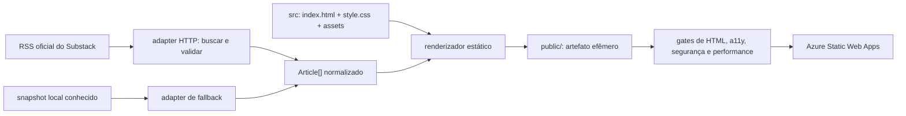

# Arquitetura do site pessoal estático

**Data:** 2026-08-15  
**Escopo:** inventário técnico e recomendação; nenhuma implementação ou publicação  
**Baseline local:** branch `main`, commit `223455a4563cdd1f812bc004786510a690c92a66`  
**URL pública verificada:** [https://delatorre.dev/](https://delatorre.dev/)

## Resumo executivo

A recomendação é manter o site como uma única página estática em Azure Static Web Apps, sem framework de interface e sem dependências JavaScript em produção. O documento publicado deve ser HTML semântico, acompanhado de um único CSS autoral canônico. JavaScript no navegador deve ser zero por padrão e existir somente se uma melhoria progressiva demonstrar necessidade; nesse caso, deve ser Vanilla JS, local e pequeno.

A atualização dos artigos do Substack é a única razão legítima para um passo de build. O feed não permite leitura por `fetch()` no navegador por CORS e o proxy AllOrigins atual adiciona uma dependência pública não confiável. Portanto, um módulo de build deve buscar o RSS no runner do GitHub Actions, validar e normalizar somente dados simples e materializar os três cards em HTML. Um snapshot local, conhecido e válido, é o adapter de fallback. O browser recebe somente HTML já escapado; não recebe XML, não consulta proxy e não injeta conteúdo remoto.

O embed oficial de inscrição permanece um `iframe` de `https://fazedordecodigo.substack.com/embed`, isolado pela origem e autorizado apenas por `frame-src` na CSP. Ele precisa de teste funcional e de acessibilidade como conteúdo de terceiro. Sem esse teste, não é correto declarar conformidade integral com WCAG 2.2 AA; no máximo, pode-se publicar uma declaração parcial que identifique o iframe.

O workflow atual deve ser dividido conceitualmente em validação e deploy: pull requests executam build determinístico com snapshot, validações e auditorias sem segredo de Azure; somente `push` em `main`, execução manual ou agenda controlada materializam o feed e publicam no Azure após os gates. O output efêmero recomendado é `public/`, já ignorado pelo repositório.

## 1. Limites e classificação das conclusões

### 1.1 Decisões já aprovadas

Estas decisões vieram da especificação e do handoff aprovados; este relatório não as reabre:

- preservar Azure Static Web Apps como hospedagem e destino de deploy;
- manter uma única página pública;
- usar HTML semântico;
- ter um único CSS canônico;
- usar JavaScript Vanilla mínimo, sem framework;
- remover Bootstrap, jQuery e plugins dependentes;
- eliminar a duplicidade e divergência entre CSS e SCSS;
- adaptar o design system Fazedor de Código à página pessoal, com Emerson como protagonista e a newsletter como conversão principal;
- usar o retrato como ponto focal, grade de 8 px, bordas finas, divisórias tracejadas, cantos generosos e laranja com parcimônia.

### 1.2 Recomendações deste relatório

- usar `css/style.css` como a única fonte autoral de estilos e remover o diretório `sass/`, source maps antigos e folhas legadas;
- não usar JavaScript no runtime para artigos, carrossel, parallax, loader ou animação de entrada;
- materializar o feed no build/deploy e publicar cards HTML, com snapshot local como fallback;
- usar `public/` apenas como output gerado e não versionado;
- hospedar localmente fontes efetivamente usadas, com licenças, ou aceitar fallbacks de sistema; não carregar Google Fonts por CSS remoto;
- limitar o conteúdo ativo remoto ao iframe oficial do Substack;
- configurar headers de segurança em `staticwebapp.config.json`;
- separar CI sem segredos de deploy com segredo;
- usar gates automáticos mais revisão manual de teclado, foco, responsividade e iframe.

### 1.3 Fora do escopo

- reescrever o site;
- definir ou aprovar a copy profissional final;
- criar issues, ADRs ou commits;
- publicar no Azure;
- afirmar conformidade WCAG do iframe sem auditoria;
- decidir obrigações jurídicas de consentimento/cookies.

## 2. Inventário local verificável

### 2.1 Superfícies atuais

| Superfície | Evidência local | Estado verificado | Consequência |
|---|---|---|---|
| Documento | [`index.html`](../../index.html) | único documento de aplicação no root, 174 linhas e 7.036 bytes | a arquitetura de uma página já existe, mas a marcação precisa ser refeita |
| CSS carregado | `animate.css`, `icomoon.css`, `bootstrap.css`, [`style.css`](../../css/style.css) e duas folhas remotas do Google Fonts | quatro folhas locais, duas remotas | contraria o objetivo de um CSS canônico e aumenta bloqueio de renderização |
| SCSS | [`sass/style.scss`](../../sass/style.scss) e árvore Bootstrap vendorizada | 76 arquivos / 248.863 bytes | não há build Sass nem fonte de verdade confiável |
| JavaScript próprio | [`js/main.js`](../../js/main.js), [`js/blog-feed.js`](../../js/blog-feed.js) | 11.888 bytes somados | lógica de UI e feed está misturada e depende de jQuery/plugins |
| JavaScript legado | jQuery 2.1.4, Bootstrap 3.3.5, Easing 1.3, Easy Pie Chart 2.1.7, Stellar 0.6.2, Waypoints 4.0.0, Modernizr 2.6.2, Respond 1.4.2 | oito arquivos locais, carregados quase todos na página | dependências antigas para comportamentos que a página aprovada não necessita |
| Script remoto | `widgets.sociablekit.com/linkedin-newsletter/widget.js` | carregado sem integridade e sem função visível na marcação atual | origem ativa de terceiro desnecessária |
| Feed | `https://www.fazedordecodigo.com/feed.xml` via `https://api.allorigins.win/get` | consulta AJAX no browser, máximo de seis itens | proxy de terceiro, CORS, disponibilidade e injeção de conteúdo são riscos de runtime |
| Deploy | [workflow Azure](../../.github/workflows/azure-static-web-apps-orange-smoke-089e11b1e.yml) | somente `push` em `main`; nenhum gate | publicação não é protegida por validação técnica |
| Headers | ausência de `staticwebapp.config.json` | nenhuma CSP ou política explícita no repositório | origens e capacidades do documento não são restringidas |
| Testes/tooling | sem `package.json`, lockfile, lint ou testes | nenhuma validação reproduzível | regressões só podem ser percebidas manualmente |

### 2.2 Peso e resíduos rastreados

Medição do working tree, excluindo `.git` e o companion visual:

| Diretório | Arquivos | Bytes |
|---|---:|---:|
| `css/` | 8 | 385.938 |
| `js/` | 12 | 195.234 |
| `sass/` | 76 | 248.863 |
| `fonts/` | 22 | 5.144.996 |
| `images/` | 29 | 810.250 |

O diretório de fontes contém duas cópias completas do Icomoon, arquivos de demonstração, um `selection.json` de 1,13 MB e fontes Glyphicons do Bootstrap. Em particular, [`fonts/icomoon/icomoon/demo.html`](../../fonts/icomoon/icomoon/demo.html), com 800.413 bytes, é outro HTML rastreado e pode ser publicado involuntariamente enquanto o Azure receber o root inteiro. Há `.DS_Store` rastreados no root e em diretórios de assets. Estes itens não servem à página aprovada e devem sair na implementação após conferência do diff.

### 2.3 Grafo de dependências atual

```text
index.html
├── Bootstrap CSS ── usado apenas por container/row/col/text-center
├── Icomoon CSS + fonte ── usado apenas por três ícones sociais
├── Animate.css
├── style.css
├── jQuery
│   ├── Easing
│   ├── Bootstrap JS (nenhum widget Bootstrap é usado)
│   ├── Waypoints ── animação de entrada
│   ├── Stellar ── parallax
│   └── Easy Pie Chart ── carregado, mas a seção de skills não existe
├── main.js ── loader, parallax, animações e carrossel
├── blog-feed.js ── jQuery.ajax → AllOrigins → RSS legado
└── SociableKit remoto
```

O layout aprovado usa grade normal de cards, não carrossel. CSS Grid/Flexbox substituem a pequena parcela do Bootstrap usada. Texto visível ou SVG inline acessível substituem Icomoon. Navegação por âncoras não precisa de plugin.

### 2.4 Divergência CSS/SCSS comprovada

No último commit, `css/style.css` recebeu 73 linhas e perdeu 345, enquanto `sass/style.scss` e `css/style.css.map` não mudaram. O carrossel foi acrescentado somente ao CSS compilado e, no mesmo patch, regras que ainda existem no SCSS foram removidas do CSS. Portanto:

- recompilar o SCSS sobrescreveria o carrossel;
- o source map não representa o CSS servido;
- editar CSS ou SCSS produz resultados diferentes;
- o repositório já não possui uma cadeia de compilação capaz de declarar qual artefato é correto.

A solução de menor complexidade é manter somente CSS autoral direto e remover Sass/Bootstrap; recriar um pipeline Sass apenas perpetuaria uma abstração sem necessidade para uma página.

### 2.5 Problemas de HTML e acessibilidade atuais

- O documento usa `div` para as seções principais e não possui `main`, `nav` ou `footer`.
- Há listas `ul` dentro de `p` em dois blocos sociais. Em HTML, a abertura da lista encerra implicitamente o parágrafo, deixando o fechamento posterior inconsistente.
- O retrato e as imagens dos artigos são `background-image` em `div`, sem alternativa textual de imagem.
- Links sociais contêm somente glifos de fonte e não têm nome acessível.
- Os botões anterior/próximo contêm apenas `‹` e `›`, sem rótulo acessível.
- O CSS remove `outline` de links e botões; não define substituto de foco.
- Não existe skip link nem comportamento para `prefers-reduced-motion`.
- O parallax usa `background-attachment: fixed`; cards e slider usam transições por `transform`.
- Links externos com `target="_blank"` não explicam a abertura de nova aba e não declaram `rel`.
- Existem dois destinos diferentes para LinkedIn.
- `og:*` e metadados para cards sociais estão presentes, mas vazios.
- O idioma está como `pt-br`; a forma canônica recomendada é `pt-BR`.
- A página pública ainda reproduz o conteúdo desatualizado do repositório.

### 2.6 Contraste dos tokens relevantes

Razões calculadas com a fórmula de luminância relativa usada pela WCAG:

| Primeiro plano | Fundo | Razão | Resultado para texto normal |
|---|---|---:|---|
| branco `#FFFFFF` | laranja legado `#FF9000` | 2,27:1 | reprova |
| preto `#000000` | laranja legado `#FF9000` | 9,24:1 | aprova |
| branco `#FFFFFF` | laranja aprovado `#FF6A00` | 2,87:1 | reprova |
| tinta `#111111` | laranja aprovado `#FF6A00` | 6,58:1 | aprova |
| muted `#6E6C67` | fundo `#F7F7F5` | 4,89:1 | aprova |

O laranja aprovado não pode receber texto branco normal. O padrão correto do mockup — texto escuro sobre laranja — deve ser preservado. Todas as combinações reais, inclusive `color-mix()`, precisam ser verificadas no CSS renderizado.

### 2.7 Riscos do JavaScript e conteúdo remoto atuais

`blog-feed.js` trata RSS como entrada não confiável, mas `main.js` concatena `title`, `excerpt`, `link` e `image` em uma string e a entrega a `slider.html()`. A remoção de tags por expressão regular só ocorre em `description`; não valida protocolos/hosts e não torna os outros campos seguros. [`innerHTML` é um injection sink e pode produzir XSS quando recebe strings não confiáveis](https://developer.mozilla.org/en-US/docs/Web/API/Element/innerHTML).

Além disso:

- o proxy AllOrigins pode observar, alterar ou indisponibilizar a resposta;
- a URL atual não é o feed oficial aprovado do Substack;
- conteúdo dinâmico não aparece no HTML inicial para crawlers e leitores sem JavaScript;
- falha de rede substitui o conteúdo por exemplos antigos sem indicar a idade;
- imagens remotas viram CSS `url()` sem allowlist;
- não há CSP para reduzir o impacto de uma injeção.

### 2.8 Falhas de CI/deploy atuais

O workflow declara condições e um job de fechamento para `pull_request`, mas o bloco `on` só possui `push`. Esses caminhos são inalcançáveis. Também:

- `actions/checkout@v3` e `Azure/static-web-apps-deploy@v1` usam referências mutáveis;
- não há `permissions` explícito para o `GITHUB_TOKEN`;
- o segredo de deploy chega diretamente ao único job;
- `app_location: "/"` e `output_location: "/"` não declaram que não existe build;
- não há validação de HTML, CSS, JS, links, acessibilidade, segurança ou performance;
- não há artefato construído separado do source tree;
- submódulos estão habilitados, embora não exista `.gitmodules`.

A [documentação oficial de build do Azure Static Web Apps](https://learn.microsoft.com/en-us/azure/static-web-apps/build-configuration) determina que, com `skip_app_build: true`, `app_location` aponte para o output e `output_location` seja vazio. O `staticwebapp.config.json` também precisa estar nesse output.

## 3. Alternativas avaliadas

| Alternativa | Vantagens | Custos/riscos | Veredicto |
|---|---|---|---|
| A. HTML/CSS direto e artigos mantidos manualmente | runtime e deploy mínimos; nenhuma dependência de feed | “mais recentes” depende de edição humana; tende a ficar desatualizado | aceitável apenas como fallback |
| B. Runtime estático + materialização de RSS no build | HTML inicial seguro e indexável; nenhuma chamada CORS/proxy no browser; fallback controlado | pequeno tooling de build e job agendado; precisa de parser XML e snapshot | **recomendada** |
| C. Browser busca feed direto ou por proxy | implementação inicial curta; atualiza sem deploy | o feed oficial foi bloqueado por CORS; proxy vira terceiro crítico; piora CSP, segurança, SEO e resiliência | rejeitada |
| D. Migrar para Astro/Next/Eleventy ou CMS | ecossistema pronto para templates e feeds | framework/gerador é maior que o domínio de uma página e amplia manutenção | rejeitada por YAGNI |

## 4. Arquitetura recomendada

### 4.1 Princípio central

O runtime deve ser mais simples que o build. Toda complexidade inevitável de rede, XML e fallback fica em um módulo de build. A interface publicada para browser é apenas HTML/CSS e o iframe explicitamente aprovado.



### 4.2 Módulos e seams

#### Módulo `articles` de build

Interface conceitual pequena:

```text
loadArticles() -> Article[]

Article = {
  title: string,
  summary: string,
  publishedAt: ISO-8601,
  url: HTTPS URL
}
```

O seam tem dois adapters reais:

1. adapter HTTP de produção, com feed fixo e validação estrita;
2. adapter snapshot para PRs, testes e indisponibilidade do feed.

A implementação esconde HTTP, XML, timeout, tamanho, ordenação, deduplicação e fallback. O renderizador e seus testes conhecem somente `Article[]`. Não se deve expor XML, `content:encoded` ou parser ao template.

#### Módulo de renderização

Recebe dados locais validados e produz `public/index.html`. Deve escapar texto e atributos por construção. Os cards são `article` com `h3`, `time[datetime]`, resumo e link HTTPS. O módulo deve gerar exatamente três cards, coerentes com o mockup aprovado, mais o link “Ver todos no Substack”.

#### Adapter Azure

O Azure não constrói o site. O job já validado entrega `public/` usando:

```yaml
app_location: "/public"
output_location: ""
skip_app_build: true
```

O output é efêmero e permanece ignorado pelo Git. A action deve ser fixada em SHA completo revisado.

### 4.3 Organização recomendada do repositório

```text
/
├── index.html                         # template/fallback semântico canônico
├── css/
│   └── style.css                      # único CSS autoral canônico
├── assets/
│   ├── images/                        # apenas imagens usadas, responsivas
│   └── fonts/                         # apenas fontes usadas + licenças
├── content/
│   └── articles.snapshot.json         # último snapshot normalizado válido
├── scripts/
│   └── build-site.mjs                 # feed + render + cópia para public/
├── staticwebapp.config.json           # headers/rotas; copiado ao output
├── package.json                       # tooling de desenvolvimento/build
├── lockfile                           # versão exata das dependências
├── public/                             # output ignorado
└── .github/workflows/
    ├── ci.yml                          # PR/push, sem segredo de deploy
    └── deploy.yml                      # main/manual/agenda, após gates
```

Os nomes de diretório são recomendados, não uma obrigação de domínio. As invariantes são: uma fonte HTML, uma fonte CSS, nenhum output versionado e separação clara entre source e artefato.

### 4.4 HTML e arquitetura de informação

Estrutura mínima:

```text
body
├── a.skip-link → #conteudo
├── header
│   └── nav[aria-label="Principal"]
├── main#conteudo
│   ├── section hero
│   ├── section provas profissionais
│   ├── section perfil
│   ├── section artigos
│   │   └── 3 × article
│   └── section newsletter
│       ├── texto de contexto
│       ├── iframe oficial
│       └── link de fallback
└── footer
```

Regras:

- um `h1` inequívoco; `h2` por seção e `h3` nos cards;
- `section` ligada ao título por `aria-labelledby` quando necessário;
- retrato como `img`, não background, com `width`, `height`, `srcset`, `sizes` e alternativa decidida editorialmente;
- datas em `time datetime="..."`;
- redes sociais com texto visível ou nome acessível; SVG decorativo com `aria-hidden="true"`;
- evitar abrir nova aba. Se o produto exigir `target="_blank"`, adicionar `rel="noopener noreferrer"` e indicação perceptível;
- conteúdo e navegação continuam completos sem CSS, JavaScript ou iframe;
- URLs de seção usam fragmentos reais; não há roteador ou `navigationFallback` de SPA;
- caminhos inexistentes devem continuar 404 para não criar duplicatas SEO da home.

O [HTML Standard](https://html.spec.whatwg.org/multipage/sections.html) define os elementos de seccionamento e landmarks usados aqui. A CI deve executar o [Nu HTML Checker](https://github.com/validator/validator) localmente, sem depender da disponibilidade do serviço web.

### 4.5 CSS canônico

`css/style.css` deve conter:

- tokens do design system como custom properties;
- reset pequeno e estilos base;
- layout com Grid/Flexbox;
- módulos visuais por seção;
- estados `:hover`, `:active`, `:focus-visible` e `:disabled` quando aplicáveis;
- breakpoints orientados pelo conteúdo, incluindo 320 CSS px;
- estilos de impressão simples, se úteis;
- bloco `prefers-reduced-motion`.

Devem ser removidos:

- `sass/` inteiro;
- `css/bootstrap.css` e map;
- `css/animate.css`;
- `css/icomoon.css` e fontes Icomoon;
- `css/flexslider.css`;
- `css/style.css.map` antigo;
- fontes Glyphicons;
- regras do template para seções inexistentes.

Fontes remotas adicionam conexão, CSS bloqueante e origens CSP. A recomendação é self-host de arquivos WOFF2/variáveis dos pesos efetivamente usados, com licenças, `font-display: swap` e fallbacks. Se o custo de três famílias for alto, preservar hierarquia antes de preservar cada família é a degradação correta.

### 4.6 JavaScript de runtime

O alvo é **zero JavaScript próprio no carregamento inicial**:

- navegação por âncoras funciona nativamente;
- artigos chegam em HTML;
- a grade substitui o carrossel;
- não existe loader, parallax, pie chart ou animação por scroll;
- o ano do footer pode ser conteúdo editorial, não precisa de script;
- o iframe executa seu próprio código em outra origem.

Se surgir necessidade comprovada, manter no máximo um `js/main.js` local, com `defer`, sem dependências, sem strings para `innerHTML` e com melhoria progressiva. O limite de peso proposto aparece nos critérios de aceite.

### 4.7 Materialização segura do feed

O relatório complementar [`2026-08-15-substack-integration.md`](./2026-08-15-substack-integration.md) confirma que `https://fazedordecodigo.substack.com/feed` responde XML, mas não envia `Access-Control-Allow-Origin`; Chrome bloqueou a leitura cross-origin. O build deve:

1. usar a URL constante HTTPS; não aceitar URL de PR, query string ou conteúdo;
2. impor timeout e limite de bytes;
3. exigir status 200 e tipo XML compatível;
4. rejeitar redirect ou revalidar esquema e host depois de qualquer redirect;
5. usar parser com DTD/entidades externas desabilitados;
6. extrair somente título, descrição em texto, data e link;
7. descartar `content:encoded` e qualquer markup executável;
8. normalizar e escapar texto; não “sanitizar” com regex;
9. aceitar links somente `https:` para host Substack aprovado;
10. ordenar por data válida, deduplicar e limitar a três itens;
11. produzir HTML e snapshot normalizado local;
12. em falha de rede, usar o último snapshot válido e registrar warning; falhar se nenhum snapshot válido existir;
13. mostrar data de atualização e sempre oferecer “Ver todos no Substack”.

PRs devem construir exclusivamente do snapshot para serem determinísticos e não executar rede externa controlada por mudança proposta. `push` em `main`, `workflow_dispatch` e uma agenda documentada podem atualizar o feed antes do deploy. A recomendação operacional é uma atualização diária; a frequência final deve refletir a cadência editorial.

### 4.8 Iframe oficial do Substack

Contrato recomendado:

```html
<iframe
  src="https://fazedordecodigo.substack.com/embed"
  title="Inscrição na newsletter Fazedor de Código"
  width="480"
  height="320"
  loading="lazy"
  referrerpolicy="strict-origin-when-cross-origin"
></iframe>
```

O CSS aplica `display: block; width: 100%; min-height: 320px; border: 0`. Não usar `height: auto`: um iframe cross-origin não herda a altura do documento interno. Em observação técnica, 320 px de altura passou sem scroll/corte nos widths 320, 480 e 800 px; isso é o menor valor testado, não prova que valores menores funcionem. A aceitação deve repetir o teste no layout real.

O [elemento `iframe`](https://developer.mozilla.org/en-US/docs/Web/HTML/Reference/Elements/iframe) precisa de `title` útil para tecnologia assistiva e permite lazy loading. Manter um link HTML adjacente para abrir a publicação/assinatura se o frame falhar ou for bloqueado.

Na observação direta registrada no relatório complementar, o campo de e-mail interno não tinha `label` nem nome ARIA e dependia do placeholder; o placeholder tinha contraste aproximado de 1,65:1, o botão 2,87:1, não foi percebido indicador de foco distinto e o viewport interno declarava `user-scalable=0`. Por ser cross-origin, a página pai não consegue corrigir esses defeitos. Ela deve, no mínimo, introduzir o frame com heading e instrução visíveis, manter o `title` e oferecer um link externo equivalente; isso mitiga a compreensão e o acesso alternativo, mas não transforma o formulário interno em WCAG 2.2 AA.

Não aplicar `sandbox` por suposição. O formulário depende de scripts e navegação e o fluxo pós-submit não foi exercitado. A implementação deve testar uma lista mínima de permissões; se isso não funcionar, documentar explicitamente a ausência do sandbox e manter CSP/frame allowlist estreita.

O embed observado carregou muitos subrecursos de analytics/ads e definiu cookies de terceiros em teste top-level. Quando enquadrado, o comportamento de armazenamento pode mudar. A CSP da página pai precisa liberar somente `fazedordecodigo.substack.com` em `frame-src`; subrecursos internos pertencem à política da origem Substack. Porém, a decisão de consentimento/privacidade precisa de aprovação humana antes da publicação. Produto/privacidade deve escolher explicitamente entre `loading="lazy"`, que ainda pode carregar o terceiro sem interação, e uma fachada “carregar formulário”, que posterga o frame até o clique, mas altera a conversão aprovada.

### 4.9 Headers de segurança no Azure

O Azure Static Web Apps permite headers globais em [`staticwebapp.config.json`](https://learn.microsoft.com/en-us/azure/static-web-apps/configuration). Baseline recomendada, a ajustar somente com evidência de recurso necessário:

```text
Content-Security-Policy:
  default-src 'self';
  base-uri 'none';
  object-src 'none';
  script-src 'self';
  style-src 'self';
  img-src 'self';
  font-src 'self';
  connect-src 'self';
  frame-src https://fazedordecodigo.substack.com;
  frame-ancestors 'none';
  form-action 'self';
  upgrade-insecure-requests

Referrer-Policy: strict-origin-when-cross-origin
X-Content-Type-Options: nosniff
Permissions-Policy: camera=(), microphone=(), geolocation=(), payment=(), usb=()
```

Não adicionar `'unsafe-inline'`, `'unsafe-eval'`, curingas HTTPS ou domínios dos trackers internos do iframe. A [CSP deve ser enviada como header HTTP](https://developer.mozilla.org/en-US/docs/Web/HTTP/Guides/CSP), não apenas em `meta`. Testar primeiro em `Content-Security-Policy-Report-Only` numa URL de preview, coletar violações legítimas e então aplicar em modo bloqueante.

HSTS com `includeSubDomains` só deve ser acrescentado depois de conferir todos os subdomínios sob `delatorre.dev`; este relatório não auditou DNS/subdomínios.

### 4.10 CI/CD

#### CI sem segredo

Gatilhos: `pull_request` para `main` e `push`. Permissão: `contents: read`; demais permissões ausentes. Passos:

1. checkout por SHA completo;
2. instalar versão LTS fixada do Node e `npm ci`;
3. construir de snapshot para `public/`;
4. verificar que o working tree não recebeu output versionado;
5. lint de CSS e JS, se houver;
6. Nu HTML Checker sem erros;
7. testes do normalizador/renderizador com fixtures maliciosas e feed inválido;
8. teste de contratos de dependência/origens/metadata;
9. servidor estático local;
10. auditoria automatizada de acessibilidade;
11. Lighthouse CI, três execuções e agregação mediana;
12. arquivar relatórios somente como artifact privado do workflow.

#### Deploy com segredo

Gatilhos: `push` em `main`, `workflow_dispatch` e agenda documentada. O job:

1. repete todos os gates;
2. tenta feed remoto constante e cai para snapshot conhecido;
3. gera `public/`, incluindo `staticwebapp.config.json`;
4. publica somente se todos os gates passaram;
5. usa action Azure fixada em SHA completo;
6. recebe apenas o segredo de deploy necessário;
7. usa `concurrency` para evitar deploy antigo terminar depois do mais novo.

Não usar `pull_request_target` para fazer checkout ou executar código de PR: [GitHub alerta que isso pode expor escrita e segredos](https://docs.github.com/en/actions/reference/workflows-and-actions/events-that-trigger-workflows). A [referência de segurança do GitHub Actions](https://docs.github.com/en/actions/reference/security/secure-use) diz que SHA completo é a única referência imutável para actions. Permissões devem ser mínimas e explícitas.

Preview environments do Azure são úteis, mas não são requisito desta arquitetura. Se habilitadas, precisam de job separado, política para forks e fechamento correto; nunca se deve entregar segredo de deploy a código não confiável.

## 5. Critérios de aceite verificáveis

Os IDs abaixo são gates da implementação. “Automático” não substitui a revisão humana: a [W3C registra que ferramentas não determinam acessibilidade sozinhas](https://www.w3.org/WAI/test-evaluate/tools/selecting/).

### 5.1 HTML e semântica

| ID | Critério | Verificação |
|---|---|---|
| HTML-01 | Existe exatamente um HTML público: `public/index.html`; não há rotas/páginas editoriais adicionais. | listar output e servir `/`; caminhos arbitrários retornam 404 |
| HTML-02 | Nu HTML Checker retorna zero erros para o output. | comando local/CI com versão fixada |
| HTML-03 | A página possui skip link, `header`, `nav`, `main` e `footer`; as seções têm títulos programáticos. | inspeção DOM + teste automatizado de landmarks |
| HTML-04 | Há exatamente um `h1`; níveis seguintes preservam hierarquia e descrevem conteúdo. | parser DOM + revisão humana |
| HTML-05 | Não existem `p > ul`, links vazios, IDs duplicados, atributos `style` ou handlers inline. | Nu + teste DOM/`rg` |
| HTML-06 | Toda imagem informativa usa `img` com `alt`, dimensões e fonte responsiva; decoração usa `alt=""`. | teste DOM + revisão editorial |
| HTML-07 | A página continua compreensível e navegável com CSS desabilitado, JS desabilitado e iframe bloqueado. | teste manual documentado |
| HTML-08 | Não existem classes Bootstrap, Icomoon, `data-stellar-*`, `animate-box` ou markup de carrossel. | teste de contrato no source/output |

### 5.2 WCAG 2.2 AA, teclado, foco e movimento

O alvo é atender **todos** os critérios A e AA aplicáveis da [WCAG 2.2](https://www.w3.org/TR/WCAG22/), não apenas os destacados abaixo.

| ID | Critério | Verificação |
|---|---|---|
| A11Y-01 | `html[lang="pt-BR"]`; mudanças de idioma relevantes usam `lang`. | teste DOM + revisão de conteúdo |
| A11Y-02 | Toda função é operável por teclado, sem armadilha, inclusive entrada e saída do iframe. | percurso manual apenas com Tab/Shift+Tab/Enter/Espaço; WCAG 2.1.1 e 2.1.2 |
| A11Y-03 | Ordem de foco segue ordem visual/lógica: skip link → navegação → CTAs → perfil → artigos → iframe/fallback → footer. | registro manual em 320, 768 e 1440 px |
| A11Y-04 | Cada item interativo tem indicador `:focus-visible` persistente, não removido, com contraste ≥3:1 e nunca totalmente oculto. | inspeção visual + contraste; WCAG 1.4.11, 2.4.7 e 2.4.11 |
| A11Y-05 | Texto normal ≥4,5:1; texto grande ≥3:1; controles/indicadores essenciais ≥3:1. | auditor de contraste sobre cores computadas; WCAG 1.4.3 e 1.4.11 |
| A11Y-06 | Nenhum texto branco normal usa `#FF6A00`; CTA laranja usa tinta escura. | teste de tokens e inspeção visual |
| A11Y-07 | Em largura de 320 CSS px e zoom de 200%, não há perda, sobreposição nem scroll horizontal da página. | Playwright + inspeção manual; WCAG 1.4.4 e 1.4.10 |
| A11Y-08 | Alvos não inline têm pelo menos 24 × 24 CSS px ou satisfazem exceção documentada. | medir bounding boxes; [WCAG 2.5.8](https://www.w3.org/WAI/WCAG22/Understanding/target-size-minimum) |
| A11Y-09 | Com `prefers-reduced-motion: reduce`, animações, transições de transform, parallax e smooth scroll não ocorrem. | emulação Playwright + teste de SO; [técnica W3C C39](https://www.w3.org/WAI/WCAG22/Techniques/css/C39) |
| A11Y-10 | Nomes acessíveis de links sociais, CTAs e artigos identificam destino/finalidade; SVGs decorativos não entram na árvore. | inspeção accessibility tree + auditoria automatizada |
| A11Y-11 | Iframe tem título útil, dimensões testadas, foco visível e fallback equivalente; nenhum elemento pai o encobre. | teste manual com teclado e leitor de tela |
| A11Y-12 | Auditoria automática retorna zero violações críticas/sérias e Lighthouse Accessibility = 1,00. | CI; resultado é gate parcial, não declaração de conformidade |
| A11Y-13 | Há revisão humana WCAG registrada para desktop/mobile e ao menos Chrome + Firefox; Safari/VoiceOver ou NVDA/Firefox entra na validação de lançamento. | checklist anexado ao PR/release |

#### Limite de conformidade do iframe

A WCAG exige conformidade da [página completa, inclusive variações responsivas](https://www.w3.org/TR/WCAG22/#cc2). O iframe do Substack é conteúdo de terceiro. Antes de afirmar “WCAG 2.2 AA”:

1. auditar o embed real e o fluxo de inscrição;
2. confirmar que ele não interfere no restante da página;
3. corrigir/remover se for possível; ou
4. usar a [declaração de conformidade parcial para conteúdo de terceiro](https://www.w3.org/TR/WCAG22/#statement-partial-conformance) identificando explicitamente o formulário.

### 5.3 Segurança de conteúdo remoto

| ID | Critério | Verificação |
|---|---|---|
| SEC-01 | Nenhum request do documento pai vai para AllOrigins, SociableKit, Google Fonts ou RSS em runtime. | Network log e `rg` por origens banidas |
| SEC-02 | Não há jQuery, Bootstrap JS/CSS, plugins, Icomoon ou scripts remotos no output. | teste de contrato + inventário de requests |
| SEC-03 | Conteúdo do feed nunca alcança `innerHTML`, `outerHTML`, `insertAdjacentHTML`, `document.write` ou URL CSS. | lint/teste de sink + revisão do módulo |
| SEC-04 | Feed usa URL constante, timeout, limite de bytes, status/tipo verificados, parser sem DTD/XXE, allowlist de URL e escaping contextual. | testes unitários com fixtures maliciosas |
| SEC-05 | Falha/timeout/XML inválido usa snapshot válido; ausência de snapshot interrompe build sem publicar página vazia. | testes de falha determinísticos |
| SEC-06 | CSP em modo bloqueante contém apenas `'self'` e o host do iframe; sem `unsafe-*`, wildcard ou data para scripts. | `curl -sSI` em preview/produção + teste parser CSP |
| SEC-07 | `X-Content-Type-Options`, `Referrer-Policy` e `Permissions-Policy` estão presentes com valores aprovados. | teste HTTP no hostname Azure e domínio customizado |
| SEC-08 | Iframe usa somente HTTPS e host exato aprovado; existe um único frame de terceiro. | teste DOM + Network log |
| SEC-09 | Configuração de `sandbox` é baseada em teste completo. Se omitida, o risco e a justificativa estão registrados. | evidência no PR/release |
| SEC-10 | Links construídos do feed são `https:` no host aprovado; `target="_blank"`, se usado, inclui `rel="noopener noreferrer"`. | testes do normalizador/renderizador |
| SEC-11 | Actions externas usam SHA completo verificado no repositório oficial; workflow declara permissões mínimas. | linter de Actions/revisão YAML |
| SEC-12 | Nenhum job que executa código de PR recebe segredo de deploy; não existe checkout de PR sob `pull_request_target`. | inspeção do workflow e teste de fork |

### 5.4 Iframe e integração Substack

| ID | Critério | Verificação |
|---|---|---|
| FRAME-01 | `src` é exatamente `https://fazedordecodigo.substack.com/embed`; `title`, `loading="lazy"` e `referrerpolicy` estão presentes. | teste DOM |
| FRAME-02 | Wrapper tem largura responsiva; frame usa `width:100%`, `height/min-height:320px`, `display:block`, `border:0`. | estilos computados |
| FRAME-03 | Em widths 320, 480 e 800 px, `scrollWidth === clientWidth` e o conteúdo termina dentro de `clientHeight`; sem corte/scroll interno inesperado. | Playwright + screenshots |
| FRAME-04 | O link de fallback permanece visível e utilizável com iframe bloqueado. | bloquear `frame-src` e testar |
| FRAME-05 | Tab entra e sai do iframe e o submit não cria armadilha; defeitos internos de rótulo, contraste, foco e zoom são registrados, pois o pai não pode corrigi-los. | teste manual com teclado/AT + relatório de exceção |
| FRAME-06 | Fluxo de inscrição pós-submit é validado em preview com endereço de teste autorizado antes do lançamento. | evidência funcional; hoje esta superfície está não testada |
| FRAME-07 | Impacto de cookies/trackers e escolha entre lazy-load automático e click-to-load receberam decisão humana de Produto/privacidade/consentimento. | aceite registrado; não é resolvido por teste técnico |
| FRAME-08 | Heading/instrução visível apresenta o formulário e um link externo equivalente permanece disponível; isso não é usado para alegar que o conteúdo interno atende AA. | inspeção DOM + teste com frame bloqueado |

### 5.5 Performance

Os [Core Web Vitals](https://web.dev/articles/vitals) usam, em campo, LCP ≤2,5 s, INP ≤200 ms e CLS ≤0,1 no percentil 75, separados por mobile/desktop. Lighthouse em CI é medição de laboratório; não substitui campo e não mede INP sem interação.

| ID | Critério | Verificação |
|---|---|---|
| PERF-01 | Exatamente uma folha CSS autoral; CSS comprimido ≤20 KiB. | inventário + gzip no CI |
| PERF-02 | JavaScript próprio inicial = 0 preferencialmente; se existir, um arquivo local, `defer`, ≤5 KiB gzip. | inventário + gzip no CI |
| PERF-03 | Zero scripts de terceiro no documento pai; o único conteúdo ativo remoto é o iframe lazy. | Network log |
| PERF-04 | Transferência inicial antes de carregar o iframe ≤350 KiB comprimidos. | Lighthouse/DevTools em perfil mobile limpo |
| PERF-05 | Imagem LCP está no HTML como `img`, não lazy, com dimensões; imagens abaixo da dobra são lazy e responsivas. | teste DOM + waterfall; [orientação LCP](https://web.dev/articles/optimize-lcp) |
| PERF-06 | Fontes usadas são locais, WOFF2, com `font-display: swap`; nenhum peso não usado é transferido. | Network log + inventário |
| PERF-07 | Lighthouse CI roda três vezes; mediana: Performance ≥0,90, Accessibility =1,00, Best Practices ≥0,95, SEO =1,00. | LHCI fixado; [configuração oficial](https://github.com/GoogleChrome/lighthouse-ci/blob/main/docs/configuration.md) |
| PERF-08 | Mediana de laboratório: LCP ≤2.500 ms, CLS ≤0,1, TBT ≤200 ms. | assertions LHCI por audit ID |
| PERF-09 | Após produção ter amostra suficiente, p75 de campo atende LCP ≤2,5 s, INP ≤200 ms e CLS ≤0,1 em mobile e desktop. | CrUX/PageSpeed/Search Console; gate operacional, não de PR |

### 5.6 SEO e cards sociais

| ID | Critério | Verificação |
|---|---|---|
| SEO-01 | `<title>` é descritivo, conciso e coerente com o `h1`, por exemplo “Emerson Delatorre — Engenharia de Software, IA e Educação”. | revisão editorial + Lighthouse; [Google Title Links](https://developers.google.com/search/docs/appearance/title-link) |
| SEO-02 | `meta[name=description]` resume a página em linguagem natural e não está vazio; `keywords` legado é removido. | teste DOM + revisão editorial; [Google snippets](https://developers.google.com/search/docs/appearance/snippet) |
| SEO-03 | `link[rel=canonical]` é absoluto e autorreferente a `https://delatorre.dev/`; redirects HTTP/www convergem para a mesma URL. | teste DOM + `curl -IL`; [Google canonical](https://developers.google.com/search/docs/crawling-indexing/consolidate-duplicate-urls) |
| SEO-04 | Open Graph contém `og:title`, `og:type=website`, `og:url`, `og:image`, `og:image:alt`, `og:description`, `og:locale=pt_BR` e `og:site_name`, todos não vazios. | parser DOM; [Open Graph Protocol](https://ogp.me/) |
| SEO-05 | Imagem social é local, HTTPS, absoluta, representativa, com dimensões declaradas e resposta 200 de tipo correto. | request + preview de card |
| SEO-06 | Metadados de compatibilidade de card (`twitter:card`, título, descrição, imagem e alt) estão preenchidos e coerentes com OG. | parser DOM + validador/preview disponível |
| SEO-07 | Conteúdo principal e três artigos estão no HTML inicial, com links rastreáveis; não dependem de JS. | baixar HTML com `curl` e inspecionar |
| SEO-08 | Se `ProfilePage`/`Person` for adotado, contém somente fatos aprovados e passa no Rich Results Test sem erros críticos. | [guia oficial ProfilePage](https://developers.google.com/search/docs/appearance/structured-data/profile-page) + revisão humana |
| SEO-09 | Lighthouse SEO =1,00 e Nu não aponta metadata fora de `head`. | CI |

Dados estruturados são recomendados, mas não devem atrasar a baseline nem introduzir fatos não aprovados. Título, descrição, canonical e Open Graph são obrigatórios.

### 5.7 CI e entrega

| ID | Critério | Verificação |
|---|---|---|
| CI-01 | PR para `main` executa todos os gates sem segredo e sem rede de feed. | PR de teste/fork |
| CI-02 | Deploy só inicia depois do job de validação aprovado e apenas em eventos confiáveis. | grafo do workflow + execução de teste |
| CI-03 | Build de PR usa snapshot; build de deploy tenta feed e registra origem/fallback no summary. | logs e artifact |
| CI-04 | `public/` é recriado do zero, ignorado pelo Git e contém `index.html`, um CSS, assets usados e `staticwebapp.config.json`. | manifesto do artifact + `git status --porcelain` |
| CI-05 | `skip_app_build: true`, `app_location: /public`, `output_location: ''`. | inspeção YAML + deploy preview |
| CI-06 | Checkout e Azure action estão fixados em SHA completo; dependências de tooling usam lockfile e `npm ci`. | policy/lint de supply chain |
| CI-07 | `permissions` é explícito e mínimo; job de validação tem apenas `contents: read`. | inspeção YAML |
| CI-08 | Uma falha em HTML, testes, a11y, CSP, budget ou Lighthouse impede publicação. | injetar falha controlada em branch de teste |
| CI-09 | `concurrency` cancela deploy anterior da mesma branch sem interromper produção válida. | duas execuções concorrentes de teste |
| CI-10 | Agenda de atualização é documentada e pode ser disparada manualmente; falha de feed não apaga artigos. | execução agendada/manual com feed simulado indisponível |

## 6. Estratégia de teste

### 6.1 Automático em todo PR

- testes unitários do normalizador com XML válido, vazio, enorme, malformado, DTD/entidades, datas inválidas, protocolos perigosos e hosts não permitidos;
- snapshot/render tests que garantam escaping de `<`, `>`, `"`, `'` e `&` nos contextos corretos;
- Nu HTML Checker;
- lint CSS/JS e teste de origens/dependências banidas;
- teste DOM de semântica, metadata, links, imagens e iframe;
- browser headless em 320, 768 e 1440 px;
- auditoria automatizada de acessibilidade;
- Lighthouse CI três vezes;
- verificação do artifact e headers via servidor compatível/preview.

### 6.2 Manual antes do lançamento

- teclado completo e foco em Chrome/Firefox;
- pelo menos uma combinação leitor de tela/browser;
- zoom 200% e reflow 320 CSS px;
- `prefers-reduced-motion` no sistema operacional;
- contraste de todos os estados e tokens computados;
- iframe em 320/480/800, inclusive submit e retorno;
- bloqueio de iframe/cookies/terceiros para verificar fallback;
- social card em pelo menos um debugger/preview real;
- screenshots desktop/mobile e inspeção de overflow/layout;
- headers no hostname Azure e em `delatorre.dev`.

### 6.3 Produção

- smoke de status, canonical e headers após deploy;
- monitorar erro/fallback do job de feed;
- conferir cards mais novos versus publicação;
- PageSpeed/CrUX quando houver amostra;
- renovar a auditoria do iframe quando o Substack alterar o embed.

## 7. Sequência recomendada de implementação

1. criar tooling mínimo, output `public/`, snapshot e CI sem alterar a página visual;
2. escrever o novo HTML semântico com conteúdo aprovado e fallback completo;
3. substituir todas as folhas por `css/style.css` e assets locais mínimos;
4. remover Bootstrap, jQuery, plugins, Icomoon, Sass, maps e resíduos;
5. implementar/testar o módulo de feed no build;
6. adicionar o iframe e seu fallback;
7. adicionar `staticwebapp.config.json`, testar CSP em report-only e bloquear;
8. fechar gates automáticos e revisão manual;
9. publicar em preview, validar headers/iframe/performance;
10. só então promover para `delatorre.dev`.

## 8. Riscos e lacunas restantes

| Lacuna | Impacto | Fechamento necessário |
|---|---|---|
| Copy/perfil final depende de fatos e aprovação humana | metadata, JSON-LD e conteúdo podem ficar incorretos | consumir relatório de perfil e aprovar copy |
| Fluxo pós-submit do iframe não foi exercitado | sandbox, foco, navegação e sucesso não estão comprovados | teste funcional com endereço autorizado em preview |
| Iframe carrega trackers/cookies de terceiros | privacidade e consentimento não são só questões técnicas | decisão humana/jurídica antes de produção |
| Embed observado falha em nome acessível, contraste, foco e possibilidade de zoom | o pai cross-origin não consegue corrigir o conteúdo interno; impede alegação honesta de AA para a página completa | oferecer instrução/link externo, reauditar e publicar declaração parcial explícita enquanto persistir |
| Frequência editorial do Substack não foi formalizada | agenda diária pode ser demais ou insuficiente | confirmar SLA de atualização |
| Assets finais do retrato/social card não foram entregues | LCP, direitos, crop e alt permanecem abertos | selecionar/otimizar assets e aprovar texto alternativo |
| Respostas/headers reais do Azure não foram inspecionados | config pode divergir no domínio customizado | validar preview e produção com `curl`/browser |
| Não há dados de campo novos | INP e p75 real não podem ser garantidos em CI | observar CrUX/RUM após publicação |
| Browser/AT matrix ainda não foi executada | automação não cobre experiência completa | revisão manual registrada |

## 9. Fontes primárias e oficiais

### Repositório e evidência local

- [`index.html`](../../index.html)
- [`css/style.css`](../../css/style.css)
- [`sass/style.scss`](../../sass/style.scss)
- [`js/main.js`](../../js/main.js)
- [`js/blog-feed.js`](../../js/blog-feed.js)
- [workflow Azure atual](../../.github/workflows/azure-static-web-apps-orange-smoke-089e11b1e.yml)
- [`README.md`](../../README.md)
- [`2026-08-15-substack-integration.md`](./2026-08-15-substack-integration.md)

### Padrões e documentação externa

- W3C, [Web Content Accessibility Guidelines 2.2](https://www.w3.org/TR/WCAG22/)
- W3C, [Technique C39: `prefers-reduced-motion`](https://www.w3.org/WAI/WCAG22/Techniques/css/C39)
- W3C WAI, [Selecting Web Accessibility Evaluation Tools](https://www.w3.org/WAI/test-evaluate/tools/selecting/)
- WHATWG, [HTML Standard — sections](https://html.spec.whatwg.org/multipage/sections.html)
- WHATWG, [HTML Standard — iframe](https://html.spec.whatwg.org/multipage/iframe-embed-object.html#the-iframe-element)
- Nu HTML Checker, [repositório oficial](https://github.com/validator/validator)
- MDN, [`innerHTML` security considerations](https://developer.mozilla.org/en-US/docs/Web/API/Element/innerHTML)
- MDN, [`iframe`](https://developer.mozilla.org/en-US/docs/Web/HTML/Reference/Elements/iframe)
- MDN, [Content Security Policy](https://developer.mozilla.org/en-US/docs/Web/HTTP/Guides/CSP)
- Microsoft Learn, [Azure Static Web Apps build configuration](https://learn.microsoft.com/en-us/azure/static-web-apps/build-configuration)
- Microsoft Learn, [`staticwebapp.config.json`](https://learn.microsoft.com/en-us/azure/static-web-apps/configuration)
- GitHub Docs, [Secure use reference for GitHub Actions](https://docs.github.com/en/actions/reference/security/secure-use)
- GitHub Docs, [Workflow events and fork restrictions](https://docs.github.com/en/actions/reference/workflows-and-actions/events-that-trigger-workflows)
- Google/web.dev, [Web Vitals](https://web.dev/articles/vitals)
- Google/web.dev, [Optimize LCP](https://web.dev/articles/optimize-lcp)
- GoogleChrome, [Lighthouse CI configuration](https://github.com/GoogleChrome/lighthouse-ci/blob/main/docs/configuration.md)
- Google Search Central, [Title links](https://developers.google.com/search/docs/appearance/title-link)
- Google Search Central, [Snippets and meta description](https://developers.google.com/search/docs/appearance/snippet)
- Google Search Central, [Canonical URLs](https://developers.google.com/search/docs/crawling-indexing/consolidate-duplicate-urls)
- Google Search Central, [`ProfilePage` structured data](https://developers.google.com/search/docs/appearance/structured-data/profile-page)
- Open Graph Protocol, [basic and image metadata](https://ogp.me/)

## Conclusão

A migração recomendada não é uma modernização de framework; é uma redução controlada. O site passa de um template legado com quatro folhas locais, duas folhas remotas, 11 referências a scripts no documento — uma delas condicional —, proxy RSS e duas fontes de estilo divergentes para um artefato estático com uma página, um CSS e nenhum JavaScript próprio necessário no runtime. A única complexidade restante — transformar RSS externo em cards — fica atrás de uma interface pequena no build, com adapters HTTP e snapshot testáveis. Essa arquitetura preserva Azure Static Web Apps, atende a direção aprovada e torna HTML, acessibilidade, segurança, performance, SEO e CI verificáveis antes do deploy.
